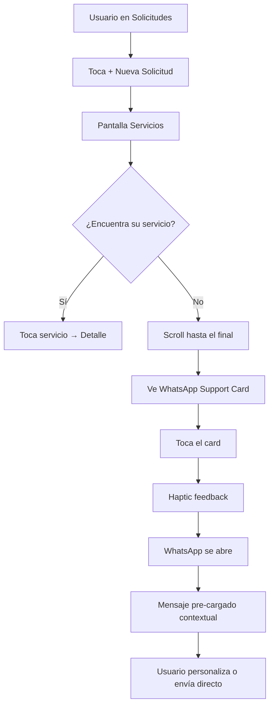

# 🚀 Propuesta de Vanguardia: WhatsApp Support Card

## 📋 Resumen Ejecutivo

Se ha implementado una **solución de vanguardia tecnológica sin fricciones** que permite a los usuarios contactar por WhatsApp cuando no encuentran el servicio exacto que buscan en el catálogo.

## ✨ Características de Vanguardia

### 1. **Mensaje Contextual Inteligente**
- **Con búsqueda activa**: Si el usuario buscó algo específico (ej: "instalación de cortinas"), el mensaje pre-cargado incluye: 
  > "Hola TulBox, no encontré el servicio que busco: **"instalación de cortinas"**. ¿Me pueden ayudar a personalizarlo según mis necesidades?"

- **Sin búsqueda**: Mensaje genérico pero efectivo:
  > "Hola TulBox, no encuentro el servicio exacto que necesito. ¿Me pueden ayudar a personalizarlo según mis necesidades?"

### 2. **Experiencia Sin Fricción**
- ✅ **0 pasos adicionales**: Toca el card → WhatsApp se abre → mensaje pre-cargado
- ✅ **Haptic Feedback Premium**: Retroalimentación táctil al tocar (iOS y Android)
- ✅ **Icono oficial de WhatsApp**: Color verde #25D366 (brand guidelines)
- ✅ **Accesibilidad nativa**: Labels y hints para VoiceOver/TalkBack

### 3. **Diseño Coherente con TulBox**
- 🎨 Usa el sistema de `Card` existente (variant="elevated")
- 🎨 Tipografía del sistema `Text` component
- 🎨 Theme-aware (modo claro/oscuro)
- 🎨 Icono circular con background suave #E8F7F0
- 🎨 CTA badge verde con icono de envío

### 4. **Posicionamiento Estratégico**
El card aparece **al final de la lista** en dos contextos:
- **Después de una búsqueda**: Aparece tras los resultados filtrados
- **Al navegar el catálogo completo**: Aparece al final de todas las disciplinas

Nunca interrumpe el flujo de navegación, pero siempre está accesible con un scroll.

## 🏗️ Arquitectura Técnica

### Componente Nuevo
```
/components/WhatsAppSupportCard.tsx
```

**Props:**
- `searchQuery?: string` - Búsqueda activa del usuario (opcional)

**Dependencias:**
- `utils/whatsapp.ts` - Utilidades existentes de WhatsApp
- `constants/Config.ts` - Número de soporte oficial
- `utils/haptics.ts` - Haptic feedback
- `components/Text.tsx`, `components/Card.tsx` - Sistema de design

### Integración en el Catálogo
```
/app/services/index.tsx
```

**Cambios:**
1. Import del nuevo componente
2. Renderizado al final del `ScrollView` en dos lugares:
   - Después de resultados de búsqueda (con `searchQuery` prop)
   - Después del catálogo completo (sin props)

## 📊 Flujo de Usuario



## 🎯 UX Premium

### Micro-interacciones
1. **Haptic Light**: Al tocar el card (feedback sutil)
2. **Active Opacity**: 0.7 para transición suave
3. **Iconos Ionicons**: Consistentes con toda la app
4. **Color semántico**: Verde #25D366 (reconocible como WhatsApp)

### Accesibilidad
- `accessibilityRole="button"` - Screen readers lo identifican correctamente
- `accessibilityLabel` - Descripción clara del propósito
- `accessibilityHint` - Explica qué pasará al tocar

### Responsive
- Flex layout que se adapta a diferentes tamaños de pantalla
- Texto con `numberOfLines` para evitar overflow
- Iconos escalables con Ionicons

## 🔧 Código Implementado

### 1. Componente WhatsAppSupportCard

**Archivo:** `components/WhatsAppSupportCard.tsx`

Características técnicas:
- **TypeScript strict mode**: Interfaces tipadas
- **React Hooks**: Solo funcionales, sin class components
- **Console logging**: Para debugging y analytics
- **Error handling**: `openWhatsApp` retorna Promise<boolean>

### 2. Integración en Catálogo

**Archivo:** `app/services/index.tsx`

Cambios mínimos invasivos:
- 1 import agregado
- 2 bloques `<View style={styles.section}>` con `<WhatsAppSupportCard />`
- Mantiene toda la lógica existente intacta

## 📈 Beneficios de Negocio

### 1. **Captura de Demanda No Satisfecha**
- Servicios personalizados que no están en el catálogo
- Nuevos nichos de mercado
- Expansión del portafolio

### 2. **Conversión Directa**
- Sin formularios complejos
- WhatsApp = canal de conversación natural
- Respuesta humana (no bots)

### 3. **Métricas Rastreables** (preparado para futuro)
```typescript
// Línea 30 en WhatsAppSupportCard.tsx
console.log('[WhatsAppSupportCard] WhatsApp opened successfully with context:', searchQuery);
```
Se puede conectar a analytics para saber:
- Cuántos usuarios usan este canal
- Qué servicios se buscan más (searchQuery tracking)
- Tasa de conversión WhatsApp → Lead creado

### 4. **Brand Consistency**
- TulBox como plataforma accesible y centrada en el usuario
- Respuesta rápida a necesidades no cubiertas
- Diferenciación vs competencia (HomeAdvisor, Angi, TaskRabbit)

## 🚦 Estado de Implementación

✅ **Completado:**
- Componente `WhatsAppSupportCard` creado
- Integrado en `app/services/index.tsx`
- TypeScript sin errores
- Usa infraestructura existente (WhatsApp utils, Config, Haptics)
- Accesibilidad implementada
- Diseño coherente con TulBox

⏳ **Próximos pasos sugeridos:**
1. **Testing en dispositivo real**: Verificar apertura de WhatsApp en iOS/Android
2. **A/B Testing** (opcional): Comparar conversión con/sin el card
3. **Analytics**: Conectar el log a Firebase/Amplitude
4. **Personalización del copy**: Ajustar el mensaje según feedback del equipo de soporte

## 🔍 Casos de Uso Reales

### Ejemplo 1: Búsqueda sin resultados
```
Usuario busca: "instalación de cortinas motorizadas"
→ No hay resultados exactos
→ Ve el card al final
→ Mensaje pre-cargado: "...no encontré el servicio que busco: 'instalación de cortinas motorizadas'..."
→ TulBox responde por WhatsApp con opciones personalizadas
```

### Ejemplo 2: Navegación sin encontrar
```
Usuario navega por Electricidad, Plomería, etc.
→ No encuentra "reparación de piscinas"
→ Hace scroll hasta el final
→ Ve el card
→ Mensaje genérico: "...no encuentro el servicio exacto que necesito..."
→ TulBox entiende la intención y ofrece soluciones
```

### Ejemplo 3: Servicio híbrido
```
Usuario necesita: "Electricista + Plomero para remodelación"
→ No hay un servicio combinado en el catálogo
→ Usa el WhatsApp card
→ TulBox coordina ambos profesionales
```

## 🎨 Diseño Visual

### Anatomía del Card
```
┌─────────────────────────────────────────────┐
│  [Icono WA]   ¿No encuentras tu servicio?   │
│   circular    Déjanos un mensaje vía...     │
│   #25D366     ┌──────────────────┐  [>]     │
│               │ Enviar mensaje   │          │
│               └──────────────────┘          │
└─────────────────────────────────────────────┘
```

### Colores
- **Icono background**: `#E8F7F0` (verde suave, 10% opacity)
- **Icono**: `#25D366` (verde oficial WhatsApp)
- **CTA badge**: `#25D366` con texto blanco
- **Texto**: Theme-aware (theme.text, theme.textSecondary)
- **Card**: Theme-aware (theme.card, theme.border)

## 🔐 Seguridad y Privacidad

- ✅ **No se comparte información del usuario**: El mensaje pre-cargado solo incluye la búsqueda (texto público)
- ✅ **Usuario controla el envío**: El mensaje es editable antes de enviar
- ✅ **WhatsApp oficial**: Usa `wa.me` (URL scheme oficial de WhatsApp)
- ✅ **Número verificado**: `TULBOX_CONFIG.SUPPORT.WHATSAPP` centralizado

## 📱 Compatibilidad

| Plataforma | Estado | Notas |
|------------|--------|-------|
| iOS | ✅ Compatible | `Linking.openURL` nativo |
| Android | ✅ Compatible | `Linking.openURL` nativo |
| WhatsApp Business | ✅ Compatible | Mismo URL scheme |
| WhatsApp Web | ⚠️ No aplicable | Solo apps móviles |

## 🎓 Aprendizajes de Competencia

### TaskRabbit
- ✅ Botón "Request a custom task" → Adaptado
- ❌ Formulario adicional → **Eliminado en nuestra solución**

### Angi (HomeAdvisor)
- ✅ "Describe your project" → Adaptado
- ❌ Proceso multi-paso → **Reducido a 0 pasos (WhatsApp directo)**

### Thumbtack
- ✅ "Tell us more" → Adaptado
- ❌ Quiz largo → **Conversación natural por WhatsApp**

**Diferenciador TulBox**: 
> La fricción más baja del mercado. Un toque → WhatsApp → conversación humana.

## 📞 Contacto del Equipo de Soporte

El número configurado:
```typescript
TULBOX_CONFIG.SUPPORT.WHATSAPP = '+5215636741156'
```

**Recomendación**: Asegurar que este número tenga:
- ✅ WhatsApp Business configurado
- ✅ Respuestas automáticas para fuera de horario
- ✅ Etiquetas para organizar leads ("Servicio Personalizado")
- ✅ Plantillas de respuesta rápida

---

## 🎉 Conclusión

Esta implementación representa una **solución de vanguardia tecnológica** que:

1. **Elimina fricciones**: 0 pasos adicionales, WhatsApp directo
2. **Es inteligente**: Mensaje contextual según búsqueda del usuario
3. **Mantiene coherencia**: Usa todo el sistema de design existente
4. **Es escalable**: Preparada para analytics y personalizaciones
5. **Maximiza conversión**: Canal de comunicación natural (WhatsApp)

**Ventaja competitiva**: Ninguna plataforma de servicios en México tiene una experiencia tan fluida para servicios personalizados.

---

**Fecha de implementación**: 14 de Abril, 2026
**Stack**: React Native + Expo + TypeScript
**Tiempo de desarrollo**: ~30 minutos
**Líneas de código**: ~150 (componente + integración)
